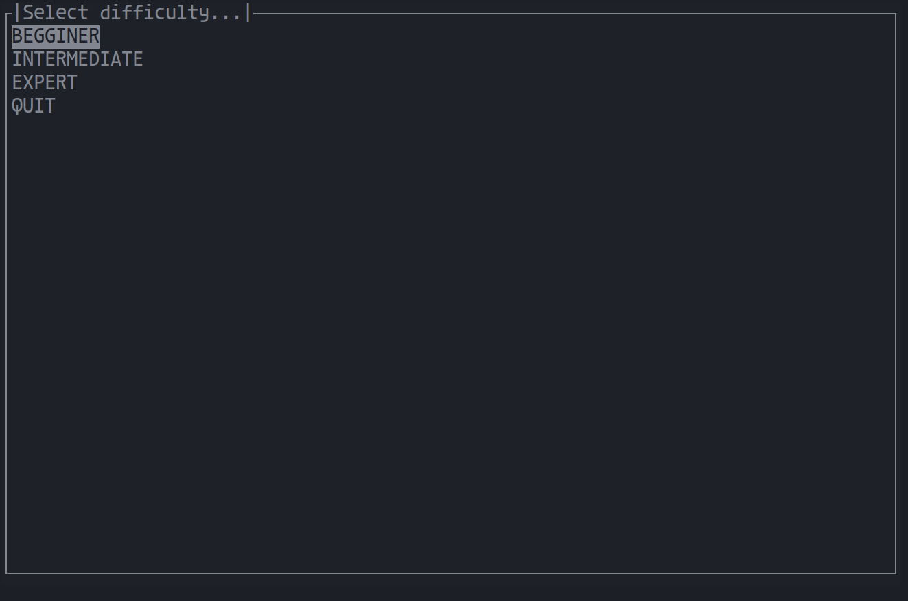
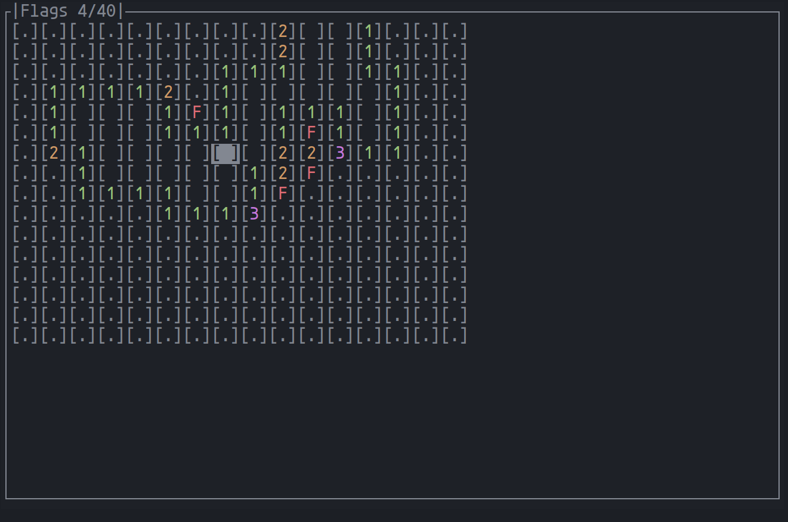
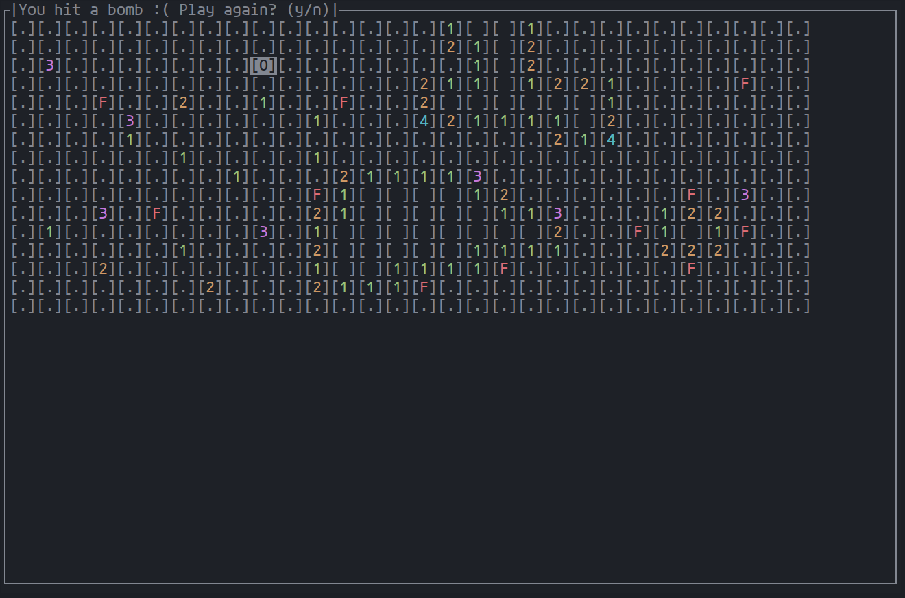

# Minesweeper ripoff

Just a very poor terminal version of the classic minesweeper game.

> This program has only been tested in Linux.

## Run locally

You need to have installed:

- GNU [Make](https://www.gnu.org/software/make/) utility
- [ncurses](https://invisible-island.net/ncurses/man/ncurses.3x.html) library

Then run:

```
make
./bin/app
```

## Controls

| Key            | Action     |
| -------------- | ---------- |
| j              | Go down    |
| k              | Go up      |
| h              | Go left    |
| l              | Go right   |
| ESPACE / ENTER | Select     |
| f              | Flag bomb  |
| r              | Reset game |
| q              | Quit game  |

## Screenshots






